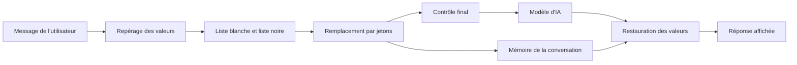

# Démarrer avec la documentation métier de PIIGhost

## En bref

**Ce qu'est PIIGhost.** PIIGhost masque les données confidentielles d'un texte avant qu'un modèle d'IA le lise, puis remet les vraies valeurs dans la réponse. C'est une bibliothèque Python, sans interface graphique. Elle se branche sur LangChain, Pydantic AI, LlamaIndex ou Claude Code, ou s'utilise à distance par le serveur `piighost-api`. Elle se configure par un fichier TOML ou JSON et par la commande `piighost`.

Le trajet d'un message :

1. L'utilisateur écrit son message avec ses vraies données, par exemple son nom et son e-mail.
2. PIIGhost repère les valeurs sensibles, par exemple les noms, les e-mails, les téléphones ou les secrets.
3. Il les remplace par des jetons. Un jeton est un texte de remplacement, comme `<<PERSON:1>>`, qui reste le même dans toute la conversation.
4. Le modèle répond avec ces jetons.
5. PIIGhost remet les vraies valeurs dans la réponse affichée.

**Ce qu'est cette documentation métier.** Elle décrit ce que PIIGhost doit faire. La façon de l'utiliser est dans la documentation technique. On y définit :

- les besoins de chaque profil, c'est-à-dire le responsable conformité, le développeur, l'exploitant et l'utilisateur de l'application.
- les règles que suit chaque traitement, chacune avec son identifiant, comme `BR-MSG-05`.
- les tests d'acceptation qui vérifient chaque besoin.
- l'endroit du code où chaque règle s'applique.

**Son objectif.** Dé-identifier une conversation avec un LLM est une pratique encore nouvelle, et ses règles ne sont écrites nulle part. Cette documentation les écrit, pour qu'on puisse les discuter, les vérifier et les faire évoluer ensemble. Chacun peut proposer un besoin ou contester une règle.

**Comment la lire.** Commencez par [Besoins par profil](needs-by-profile.md) pour trouver ce qui concerne votre profil. En cas de désaccord, le code et les tests ont raison. Quand cette documentation ne correspond pas au code, l'écart est noté dans le [registre des écarts](reference/doc-code-gaps.md). Les termes sont définis dans le [glossaire](glossary.md).

## Je cherche à comprendre…

| Besoin métier | Page à lire |
|---|---|
| Ce que chaque profil attend de PIIGhost, et comment le vérifier | [Besoins par profil](needs-by-profile.md) |
| Ce que le modèle voit vraiment d'un message | [Protéger un message avant l'envoi au modèle](processes/protect-a-message.md) |
| Pourquoi un nom est resté en clair, ou à moitié | [Protéger un message avant l'envoi au modèle](processes/protect-a-message.md#questions-fréquentes) |
| Comment une personne garde le même jeton d'un message à l'autre | [Suivre une conversation et restaurer la réponse](processes/follow-a-conversation.md) |
| Ce qui se passe quand on corrige un message à la main | [Suivre une conversation et restaurer la réponse](processes/follow-a-conversation.md#corriger-un-repérage) |
| Comment effacer une conversation (droit à l'effacement) | [Suivre une conversation et restaurer la réponse](processes/follow-a-conversation.md) |
| Garder le nom de l'entreprise en clair, ou toujours masquer un code interne | [Imposer une liste blanche et une liste noire](processes/impose-a-whitelist-and-blacklist.md) |
| Ce que reçoit un outil de l'agent, et ce que le modèle lit de son résultat | [Laisser un outil agir sur les vraies valeurs](processes/let-a-tool-act.md) |
| Pourquoi un jeton apparaît pendant qu'une réponse s'affiche | [Afficher une réponse streamée](processes/show-a-streamed-reply.md) |
| Ce que voit chaque acteur selon l'outil utilisé (LangChain, Claude Code…) | [Brancher la protection sur un agent et ses outils](integrations/agents-and-tools.md) |
| Ce qui se passe quand un modèle répond mal | [Besoins par profil, points de vigilance](needs-by-profile.md#points-de-vigilance) |
| Où sont stockées les données des conversations, et si elles sont chiffrées | [Stocker les conversations et protéger les traces](operations/storage-and-encryption.md) |
| Le sens d'un terme ou d'un sigle | [Glossaire](glossary.md) |
| Les endroits où la documentation et le code divergent | [Registre des écarts doc / code](reference/doc-code-gaps.md) |
| Ce qui est décidé et reste à faire | [Points à régler](reference/open-points.md) |

## Modifier le code

Pour modifier le code, la documentation technique indique quelles pages lire et quels fichiers ouvrir. Voir [Modifier le code de piighost](../../docs/fr/community/changing-the-code.md).

## Les groupes de la documentation métier

- **Besoins** : [Besoins par profil](needs-by-profile.md).
- **Processus** : [Protéger un message](processes/protect-a-message.md), [Suivre une conversation](processes/follow-a-conversation.md), [Imposer une liste blanche et une liste noire](processes/impose-a-whitelist-and-blacklist.md), [Laisser un outil agir](processes/let-a-tool-act.md), [Afficher une réponse streamée](processes/show-a-streamed-reply.md).
- **Intégrations** : [Brancher la protection sur un agent et ses outils](integrations/agents-and-tools.md).
- **Exploitation** : [Configurer un pipeline par fichier, hub et ligne de commande](operations/configuration-and-hub.md), [Stocker les conversations et protéger les traces](operations/storage-and-encryption.md).
- **Architecture** : [Ajouter ou remplacer un composant du pipeline](architecture/ports-and-extension.md).
- **Tests** : [Lancer et écrire les tests](tests/run-and-write-tests.md), [Tests d'acceptation](tests/acceptance-tests.md).
- **Référence** : [Glossaire](glossary.md), [Registre des écarts doc / code](reference/doc-code-gaps.md), [Décisions de conception](reference/decisions.md), [Points à régler](reference/open-points.md).

## Points de vigilance transverses

1. **L'identifiant de conversation décide du partage des jetons.** Un appel sans identifiant est refusé, par LangChain, les hooks Claude Code et le serveur. Une application qui nomme `default` partage ses jetons entre tous ses utilisateurs. Seule la commande `piighost` se rabat sur `default`, pour une commande isolée. Voir [Suivre une conversation](processes/follow-a-conversation.md#règles-à-connaître).
2. **Corriger un message ancien peut renuméroter les jetons**, et une réponse du modèle peut alors être restaurée avec le nom d'une autre personne. Voir [Suivre une conversation](processes/follow-a-conversation.md#règles-à-connaître).
3. **La mémoire et l'historique de l'agent contiennent des données en clair.** Tout ce qui n'est pas traité en contient aussi, c'est-à-dire un outil Claude Code non listé (Grep), ou un résultat d'outil sous la stratégie « Entrée seule » ou « Aucun ». Chiffrez le stockage, et protégez l'historique de LangGraph ou de Pydantic AI. Voir [Stocker les conversations](operations/storage-and-encryption.md) et [Brancher la protection sur un agent](integrations/agents-and-tools.md#pièges).
4. **Les traces techniques portent le texte en clair par défaut.** Configurez un masqueur de traces avant de les envoyer à un service tiers. Voir [Stocker les conversations et protéger les traces](operations/storage-and-encryption.md#masquer-les-traces).
5. **Effacer une conversation ne vide que le processus qui reçoit la demande.** Quand `token_memo_ttl` n'est pas réglé, les autres processus gardent une copie temporaire. Voir [Stocker les conversations](operations/storage-and-encryption.md#règles-à-connaître).
6. **Un détecteur ou un garde-fou à base de modèle échoue en ouvert.** Une sortie illisible du modèle donne zéro détection, et le message part sans protection. Voir les [points de vigilance](needs-by-profile.md#points-de-vigilance).
