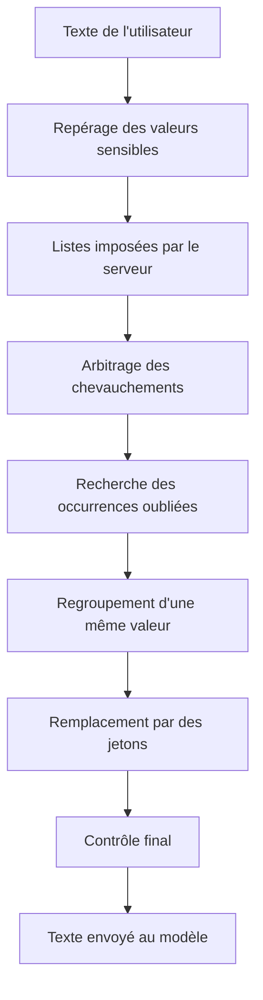

# Protéger un message avant l'envoi au modèle

## En bref

- Avant d'envoyer un texte au modèle, PIIGhost y repère les valeurs sensibles et les remplace par des jetons comme `<<PERSON:1>>`.
- Une même valeur reçoit un seul jeton dans tout le texte, même écrite avec une autre casse ou d'autres espaces.
- La réponse du modèle est ensuite restaurée : chaque jeton redevient la vraie valeur.
- Un contrôle final, s'il est activé, bloque l'envoi quand une valeur sensible reste visible.
- Les listes de motifs ne vérifient pas les clés de contrôle (carte, IBAN). Une valeur mal recopiée reste masquée.

Les termes sont définis dans le [glossaire](../glossaire.md). Pour une conversation en plusieurs messages, lisez ensuite [Suivre une conversation et restaurer la réponse](suivre-une-conversation.md).

## Pour le métier

PIIGhost n'a pas d'écran. Ce que vous pouvez constater, c'est le texte reçu par le modèle et la réponse rendue à l'utilisateur. Pour essayer sur une phrase, l'équipe technique lance `piighost anonymize "votre phrase"`.

### Le trajet d'un message



1. **Repérage.** Un ou plusieurs détecteurs cherchent les valeurs : par forme (e-mail, téléphone), par modèle d'IA (noms, lieux) ou par grand modèle de langage.
2. **Listes serveur.** Les valeurs à toujours masquer ou à ne jamais masquer sont appliquées. Voir [Imposer des valeurs toujours ou jamais masquées](imposer-des-listes-serveur.md).
3. **Chevauchements.** Quand deux repérages se recouvrent, un seul passage est gardé.
4. **Occurrences oubliées** (étape facultative). Chaque valeur trouvée est recherchée ailleurs dans le texte.
5. **Regroupement.** Les occurrences d'une même valeur et d'un même type forment un seul groupe.
6. **Remplacement.** Chaque groupe reçoit un jeton.
7. **Contrôle final** (facultatif). Le texte protégé est relu pour y chercher un reste de valeur sensible.

### Règles à connaître

**RG-MSG-01.** Quand une valeur revient sous une autre casse ou avec d'autres espaces, alors elle reçoit le même jeton. Exemple : « Patrick a appelé. Rappelez patrick demain. » devient « `<<PERSON:1>>` a appelé. Rappelez `<<PERSON:1>>` demain. »

**RG-MSG-02.** Quand une valeur a plusieurs graphies, alors la restauration remet partout la première graphie rencontrée. Dans l'exemple précédent, la réponse restaurée affiche « Patrick » aux deux endroits.

**RG-MSG-03.** Quand un nom est collé à un autre par un trait d'union, alors il n'est pas reconnu comme le même mot. Exemple : « Patrick » repéré ne masque pas « Jean-Patrick ». Pourquoi : un prénom court ne doit pas être relié à un prénom composé différent.

**RG-MSG-04.** Quand deux repérages se recouvrent, alors le plus sûr gagne (réglage par défaut). Le reste du plus long passage peut alors partir en clair. Un second réglage masque toute la zone couverte :

| Réglage | « Contrat signé par Loni M. Wirth le 12/03/2026. » devient |
|---|---|
| Le plus sûr gagne (par défaut) | Contrat signé par Loni M. `<<NAME:1>>` le 12/03/2026. |
| Union des passages | Contrat signé par `<<NAME:1>>` le 12/03/2026. |

Ici, un motif sûr à 100 % a trouvé « Wirth » et un modèle sûr à 70 % a trouvé « Loni M. Wirth ». À égalité parfaite de confiance et de position, le premier détecteur déclaré gagne.

**RG-MSG-05.** Quand une valeur est écrite avec une espace insécable ou fine, alors un motif écrit avec une espace normale la trouve quand même. Exemple : « 06 12 34 56 78 » tapé dans un traitement de texte, avec des espaces insécables, devient `<<PHONE:1>>`.

**RG-MSG-06.** Quand un motif reconnaît la forme d'une carte ou d'un IBAN, alors la valeur est masquée sans vérifier sa clé de contrôle. Pourquoi : une valeur abîmée par une reconnaissance de caractères aurait une clé fausse, et la rejeter la laisserait partir en clair.

**RG-MSG-07.** Quand l'utilisateur tape lui-même un texte qui a la forme d'un jeton, alors ce texte est neutralisé par un caractère invisible. Exemple : « Claire écrit `<<PERSON:2>>` ici » ne pourra pas se faire passer pour un vrai jeton à la restauration. Pourquoi : sinon, un jeton tapé à la main pourrait récupérer la valeur d'une autre personne.

**RG-MSG-08.** Quand le contrôle final trouve une valeur sensible dans le texte protégé, alors l'envoi est bloqué avec `Anonymized text still contains PII: ['EMAIL']`. Le message nomme les types restants, jamais les valeurs.

**RG-MSG-09.** Quand la recherche des occurrences oubliées est active, alors elle ignore la casse. Elle trouve « patrick » après « Patrick », au prix de faux positifs sur des mots courants.

### Ce que voit l'utilisateur final

Rien : il écrit en clair et lit une réponse en clair. Seul le modèle voit les jetons. Si le contrôle final bloque un message, l'application reçoit une erreur. Le message affiché à l'utilisateur dépend alors de l'application.

### Questions fréquentes

**Une partie d'un nom est partie en clair (« Loni M. »).** Deux repérages se chevauchaient, et le plus sûr ne couvrait qu'une partie du nom (RG-MSG-04). Demandez le réglage « Union des passages ».

**Un numéro de carte faux a été masqué.** C'est voulu : aucune clé de contrôle n'est vérifiée (RG-MSG-06).

**« Jean-Patrick » est resté en clair alors que « Patrick » est masqué.** Le trait d'union lie les deux prénoms (RG-MSG-03). Il faut que le détecteur repère « Jean-Patrick » lui-même.

**Le traitement s'arrête avec `Anonymized text still contains PII`.** Le contrôle final a trouvé un reste (RG-MSG-08). Faites ajouter le type manquant au détecteur principal.

## Pour les développeurs

### Où vivent les règles

| Règle | Emplacement |
|---|---|
| Ordre des étapes | `src/piighost/pipeline/base.py:352-393` (`AnonymizationPipeline.anonymize`) |
| RG-MSG-01 | `components/linker/exact.py:8-21`, `text/normalization.py:61-71` (`value_key`) |
| RG-MSG-02 | `components/anonymizer/base.py` (`deanonymize` remplace par `entity.text`), `models/entity.py` |
| RG-MSG-03 | `text/boundaries.py` (`WORD_JOIN_CHARS`) |
| RG-MSG-04 | `components/overlap_resolver/confidence.py:9-21`, `merge.py`, `overlap_resolver/base.py` (`by_confidence`, `_conflict_groups`) |
| RG-MSG-05 | `text/normalization.py:45-58`, `components/detector/regex.py:65-79` |
| RG-MSG-06 | `components/detector/regex.py:11-30` |
| RG-MSG-07 | `components/anonymizer/span.py:26-40`, `_neutralize` lignes 79-95 |
| RG-MSG-08 | `pipeline/base.py:313-341` (`_guard`), `pipeline/base.py:400-410` |
| RG-MSG-09 | `components/expander/word_boundary.py:11-31` |

Valeurs par défaut quand seul le détecteur est fourni : `ExactEntityLinker`, `Anonymizer(LabelCounterPlaceholderFactory())`, `ConfidenceOverlapResolver` (`pipeline/base.py:167-187`). L'expansion, la résolution d'entités, les listes et le contrôle final sont désactivés.

### Modifier une étape

1. Choisissez le port de l'étape (voir [Ajouter ou remplacer un composant](../architecture/ports-et-extension.md)).
2. Passez votre composant au constructeur : `AnonymizationPipeline(detector, overlap_resolver=MergeOverlapResolver())`, ou en configuration `[overlap_resolver] type = "merge"`.
3. Pour le contrôle final, passez `guard=DetectorGuardRail(un_détecteur)`.

#### Vérifier

```bash
uv run pytest tests/pipeline/test_pipeline.py tests/components
```

Puis `echo "Tél. 06 12 34 56 78" | uv run piighost anonymize --config <fichier>` doit renvoyer un jeton à la place du numéro.

### Pièges

- **Le résolveur de chevauchements ne se désactive pas.** `overlap_resolver=None` installe `ConfidenceOverlapResolver`. `Anonymizer.render` lève `OverlappingSpansError` s'il reste un chevauchement.
- **L'expansion tourne après le résolveur.** Elle saute toute occurrence qui touche un caractère déjà couvert, et cherche les valeurs les plus longues d'abord (`expander/base.py:30-75`).
- **Le caractère de neutralisation reste dans le texte restauré.** Un jeton tapé par l'utilisateur revient avec un U+200B invisible après son premier caractère. Un traitement en aval qui compare des chaînes exactes peut échouer.
- **`RegexDetector` compile sous `re.ASCII`.** `\d` ne prend que 0 à 9, et `\w` s'arrête au premier caractère accentué.
- **Un détecteur seul peut rendre des détections qui se chevauchent.** Le port l'autorise. Ne testez jamais un détecteur en sortant de la chaîne avant le résolveur.
- **Un garde-fou à score (modération) ne localise rien.** Les valeurs de la liste noire ne peuvent pas en être exemptées (`pipeline/base.py:318-322`).

### Écarts doc / code

Aucun écart constaté sur cette page. L'ordre des étapes de `AGENTS.md` et de `docs/en/architecture.md` correspond au code.

### Tests

| Test | Couvre |
|---|---|
| `tests/pipeline/test_pipeline.py` | Ordre des étapes, valeurs par défaut, contrôle final |
| `tests/components/overlap_resolver/` | Les deux résolveurs, l'égalité gagnée par le premier détecteur |
| `tests/components/expander/test_word_boundary.py` | Recherche des occurrences, pas de chevauchement ajouté |
| `tests/components/anonymizer/test_span_anonymizer.py` | Remplacement, neutralisation des jetons tapés, refus d'un chevauchement |
| `tests/text/` | Limites de mots, normalisation des espaces |
| `tests/components/detector/test_contract.py` | Même sortie pour tous les détecteurs |

Non couvert : la présence du U+200B dans le texte restauré n'est pas présentée comme un comportement attendu dans les tests. Ce point a été constaté en lançant le pipeline.
